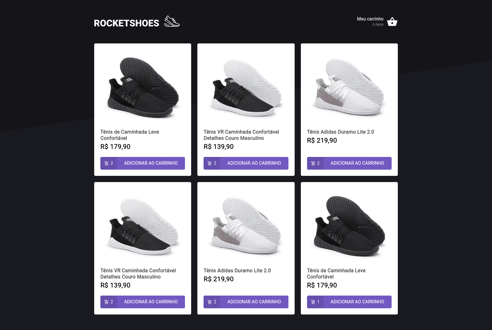
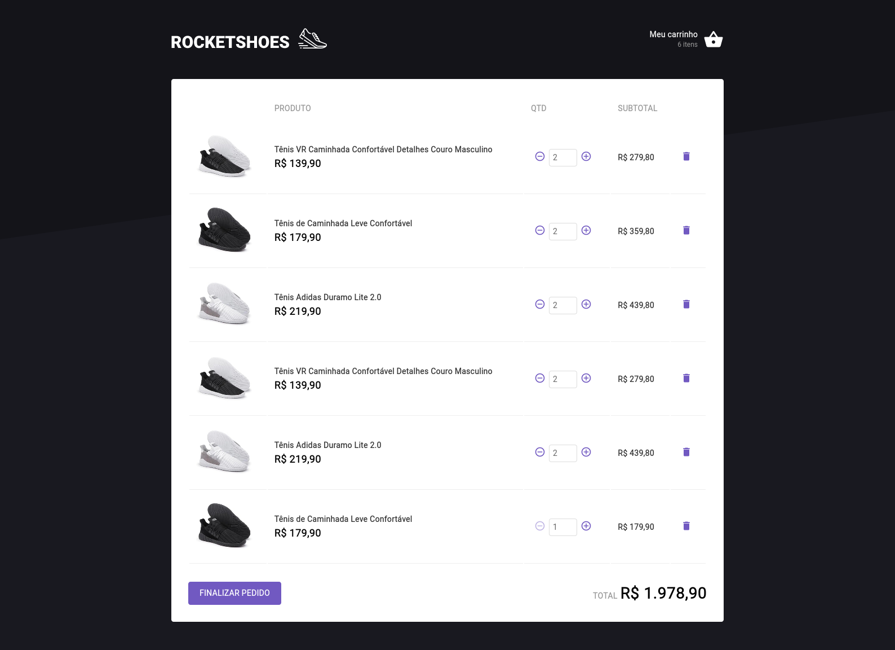

# Desafio 03 - Hook de carrinho de compras


> _Obrigado a Rocketseat :rocket: pela imagem acima!_

### 🗒️ Sobre o desafio

Nesse desafio, você deverá criar uma aplicação para treinar o que aprendeu até agora no ReactJS.

Essa será uma aplicação onde o seu principal objetivo é criar um hook de carrinho de compras. Você terá acesso a duas páginas, um componente e um hook para implementar as funcionalidades pedidas nesse desafio.

**Como e o que deve ser feito:**

- Adicionar um novo produto ao carrinho;
- Remover um produto do carrinho;
- Alterar a quantidade de um produto no carrinho;
- Cálculo dos preços sub-total e total do carrinho;
- Validação de estoque;
- Exibição de mensagens de erro;
- Entre outros..

### :paintbrush: Template da aplicação

https://github.com/rocketseat-education/ignite-template-reactjs-criando-um-hook-de-carrinho-de-compras

### :man_technologist: Comandos para execução

```bash
  # Instalar dependências
  yarn install

  # Executar o Json server
  yarn server

  # Iniciar aplicação
  yarn dev
```

### :camera_flash: Screenshots





> Design da aplicação feito pela Rocketseat! :rocket:
